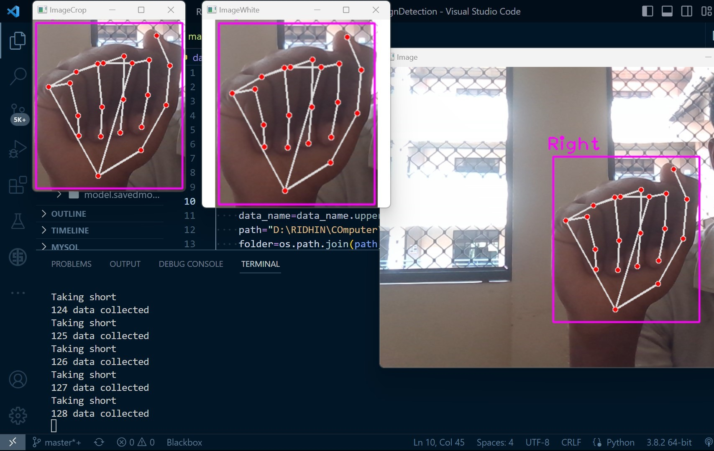
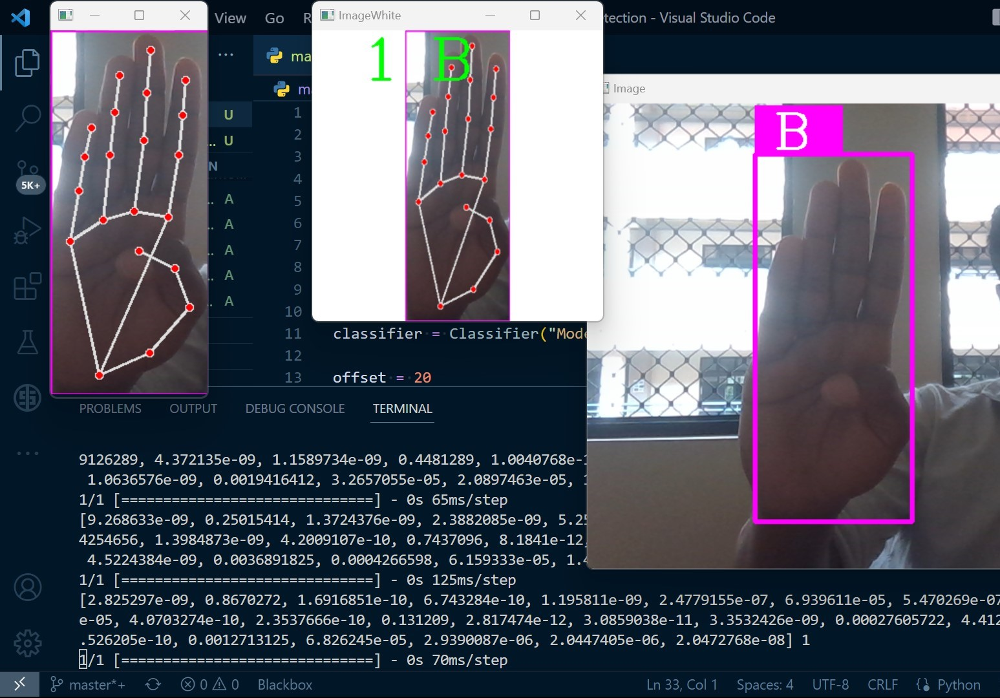

# Hand Sign To Text

In this project, we will create a hand sign detector. We will use American Sign Language (ASL) as an example. This project will convert ASL into text. This project will include both detection and classification. This project is written in Python.


#
## Python package
Make sure your system have following python pakages installed.Use the package manager [pip](https://phoenixnap.com/kb/install-pip-windows) to install python package.

1.OpenCv

OpenCv is a huge open-source library for computer vision, machine learning, and image processing.

To install opencv run this command  
```
pip install opencv-python
```
To check if opencv installed run
````
pip show numpy
````
Verison 1.23.5 is used in this project

2.Mediapipe 

Mediapipe is an open-source framework for creating a series of steps to analyze and understand visual data such as images or videos using computer algorithms. It can handle different types of input data such as video or audio.

To install mediapipe run this command  
```
pip install mediapipe
```
To check if mediapipe installed run
````
pip show mediapipe
````
Version  0.10.0 is used in this project

3.TensorFlow

TensorFlow is a Python library for fast numerical computing created and released by Google.The TensorFlow Python library provides a powerful API for building and training machine learning models using the Python programming language


To install Tensorflow run this command

    pip install tensorflow-cpu

To check if tensorflow installed run
```
pip show tensorflow
```

Verison 2.12.0 is used in this project

4.Keras

Keras is an open-source software library that provides a Python interface for a subset of machine learning and for a deep learning algorithms

Keras is automatically installed when you install tensorflow

To install keras run this command
    
    pip install keras
To check if keras is installed run this command

    pip show keras
Verison 2.12.0 is used in this project
#
## How To Run The Program

There is two part to the program.
#### 1.dataCollection.py
Datacollection.py file collects data from user for the model. Make sure that the 'path' is set accurately. Press s button to collect data and press q button to quit the program. Each ASL sign has a different simple; make sure to take multiple angle photos for an accurate model. After collecting data, go to the [TechableMachine](https://teachablemachine.withgoogle.com/train/image).Rename the class with your data name, upload the data you collected, and train the model. After training the model, export it. Select TensorFlow and download the model.

Extract the file to the folder "Model"

#### 2.main.py
Run this file and place our hand in front of the
camera show the gustures and it will predict the hand sign.
#
## Screenshots
1.dataCollection.py
ASL for A



2.main.py
program detect the hand  gesture and predict the output



#
## Software
We used Visual Studio Code to run the python program.Python 3.8.2 is used for this project
#
## System Requirement
1.Windows 10

2.Webcam

3.Python 

4.Keras 

5.Visual Studio Code

6.TensorFlow

7.Mediapipe

8.Opencv

#
## References
[YouTube](https://www.youtube.com/watch?v=wa2ARoUUdU8&pp=ygURaGFuZCBzaWduIHRvIHRleHQ%3D)

[Mediapipe](https://developers.google.com/mediapipe)

[OpenCV](https://pypi.org/project/opencv-python/) 

[TensorFlow](https://www.tensorflow.org/api_docs/python/tf)