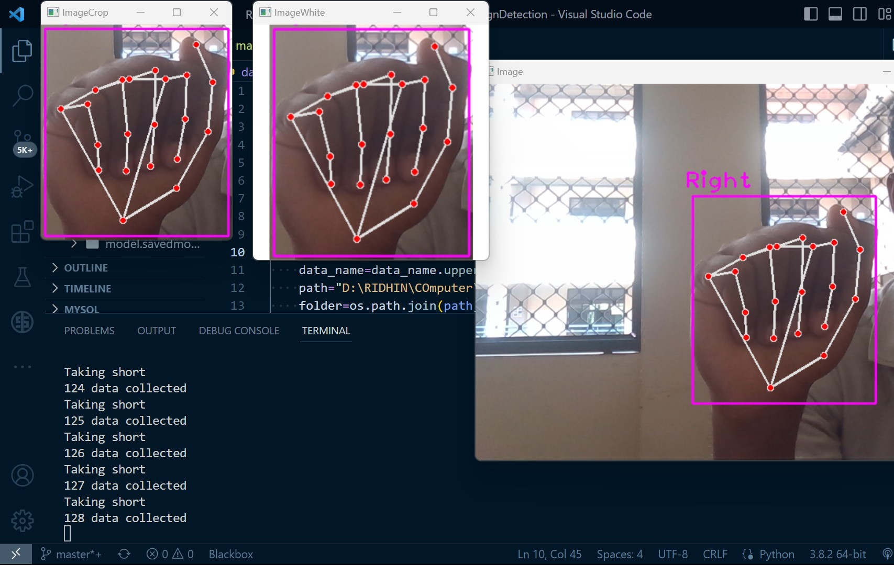
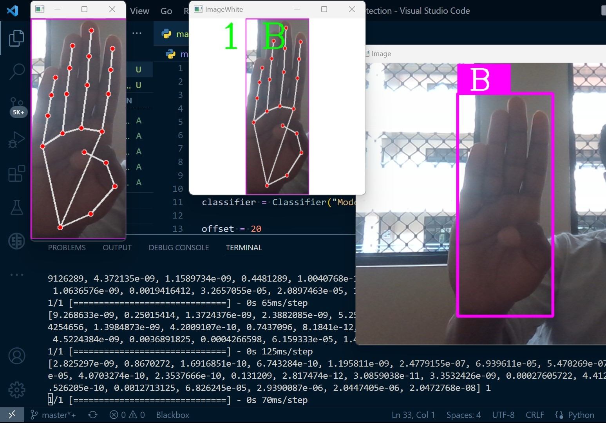

# Hand Sign To Text

In this project, we will create a hand sign detector. We will use American Sign Language (ASL) as an example. This project will convert ASL into text. This project will include both detection and classification. This project is written in Python.

## Python package
Make sure your system have following python pakages installed.

#### 1.OpenCv
OpenCV is a huge open-source library for computer vision, machine learning, and image processing.

#### 2.Mediapipe 
Mediapipe is an open-source framework for creating a series of steps to analyze and understand visual data such as images or videos using computer algorithms. It can handle different types of input data such as video or audio.

#### 3.TensorFlow
TensorFlow is a Python library for fast numerical computing created and released by Google.The TensorFlow Python library provides a powerful API for building and training machine learning models using the Python programming language

#### 4.Keras
Keras is an open-source software library that provides a Python interface for a subset of machine learning and for a deep learning algorithms

## How To Run The Program

There is two part to the program.
#### 1.dataCollection.py
Datacollection.py file collects data from user for the model. Make sure that the 'path' is set accurately. Press s button to collect data and press q button to quit the program. Each ASL sign has a different simple; make sure to take multiple angle photos for an accurate model. After collecting data, go to the given link: https://teachablemachine.withgoogle.com/train/image. Rename the class with your data name, upload the data you collected, and train the model. After training the model, export it. Select TensorFlow and download the model.

Extract the file to the folder "Model"

#### 2.main.py
Run this file and place our hand in front of the
camera show the gustures and it will predict the hand sign.
## Screenshots
1.dataCollection.py
ASL for A

2.main.py
program detect the hand  gesture and predict the output

